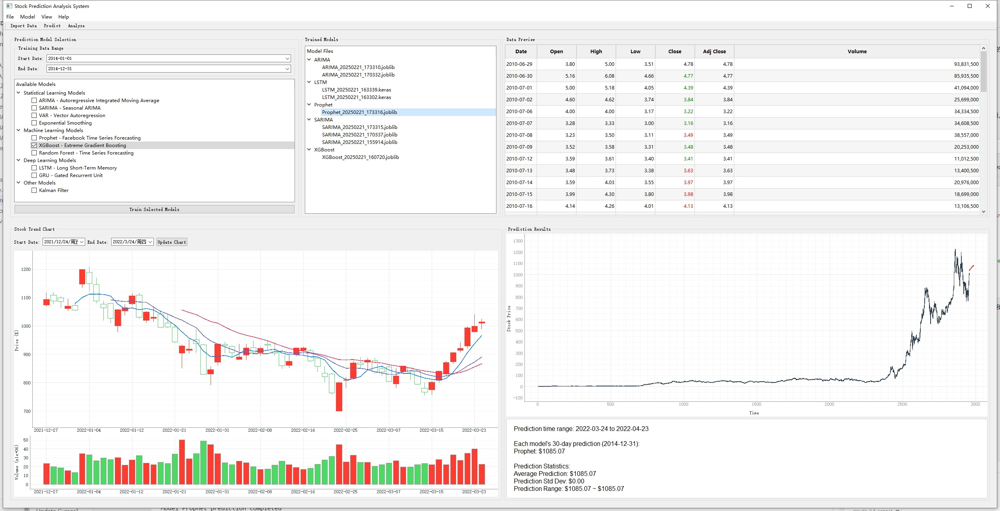
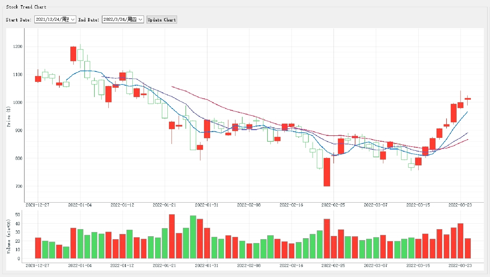
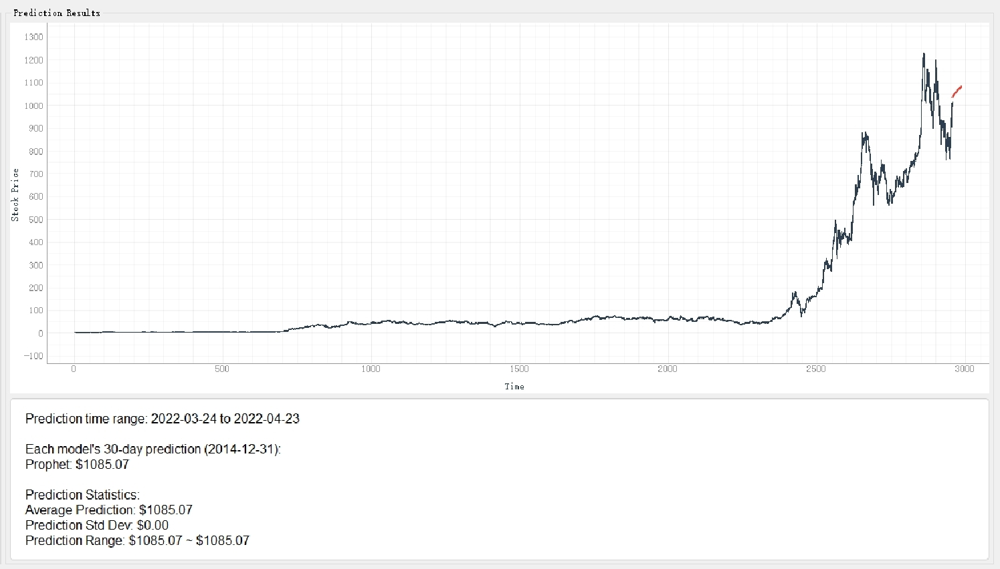

# Tesla Stock Prediction


**Tesla Stock Prediction** is a comprehensive machine learning and time series analysis project designed to predict Tesla (TSLA) stock prices using a variety of advanced models. This project leverages statistical, machine learning, and deep learning techniques to provide accurate stock price forecasts, making it a valuable tool for investors, traders, and data enthusiasts.

---

## Features

- **Multiple Model Support**: Includes ARIMA, SARIMA, Prophet, LSTM, GRU, XGBoost, Random Forest, VAR, Exponential Smoothing, and Kalman Filter models.
- **Data Preprocessing**: Automatically scales and prepares stock data for training and prediction.
- **Model Training**: Train individual models or all models at once with customizable parameters.
- **Prediction Evaluation**: Evaluate model performance using metrics like MSE, MAE, and RMSE.
- **User-Friendly Interface**: Built with PyQt5 for an intuitive and interactive experience.
- **Scalable Architecture**: Easily extendable to include additional models or datasets.

---

## Installation

### Prerequisites
- Python 3.8+
- Required libraries: `pandas`, `numpy`, `scikit-learn`, `tensorflow`, `statsmodels`, `prophet`, `xgboost`, `PyQt5`, `pyqtgraph`

### Steps
1. Clone the repository:
   ```bash
   git clone https://github.com/your-username/tesla-stock-prediction.git
   cd tesla-stock-prediction
   ```

2. Install dependencies:
   ```bash
   pip install -r requirements.txt
   ```

3. Run the application:
   ```bash
   python main.py
   ```

---

## Usage

### 1. Import Data
- Load your stock data (e.g., `TSLA.csv`) through the **File** menu or toolbar.
- The application supports CSV files with columns: `Date`, `Open`, `High`, `Low`, `Close`, `Volume`.

### 2. Select Models
- Choose from a variety of models in the **Model Selection** panel.
- Customize training parameters such as date range and sequence length.

### 3. Train Models
- Train individual models or all selected models at once.
- Monitor training progress in real-time.

### 4. Predict Stock Prices
- Use trained models to predict future stock prices.
- Visualize predictions alongside historical data in interactive charts.

### 5. Evaluate Performance
- Compare model performance using evaluation metrics (MSE, MAE, RMSE).
- Save trained models for future use.

---

## Models Overview

| Model                  | Description                                                                 |
|------------------------|-----------------------------------------------------------------------------|
| **ARIMA**              | Autoregressive Integrated Moving Average for time series forecasting.       |
| **SARIMA**             | Seasonal ARIMA for capturing seasonal trends in stock data.                 |
| **Prophet**            | Facebook's time series forecasting model, ideal for stock price prediction. |
| **LSTM**               | Long Short-Term Memory neural network for sequential data.                  |
| **GRU**                | Gated Recurrent Unit, a simpler alternative to LSTM.                        |
| **XGBoost**            | Extreme Gradient Boosting for regression-based predictions.                |
| **Random Forest**       | Ensemble learning method for robust predictions.                            |
| **VAR**                | Vector Autoregression for multivariate time series analysis.                |
| **Exponential Smoothing** | Smoothing technique for trend and seasonality.                            |
| **Kalman Filter**      | Recursive filter for estimating stock prices from noisy data.               |

---

## Project Structure

```
tesla-stock-prediction/
├── models/                  # Saved trained models
├── data/                    # Stock data (e.g., TSLA.csv)
├── main.py                  # Main application entry point
├── model_trainer.py         # Model training and evaluation logic
├── requirements.txt         # Python dependencies
├── README.md                # Project documentation
└── LICENSE                  # MIT License
```

---

## Screenshots

### Main Interface


### Candlestick Chart


### Prediction Results


---

## Why This Project?

- **Accurate Predictions**: Combines multiple advanced models for reliable stock price forecasts.
- **User-Friendly**: Intuitive GUI for easy interaction and visualization.
- **Extensible**: Add new models or datasets with minimal effort.
- **Educational**: Great for learning about time series analysis, machine learning, and PyQt5.

---

## Contributing

Contributions are welcome! If you'd like to contribute, please follow these steps:
1. Fork the repository.
2. Create a new branch (`git checkout -b feature/YourFeature`).
3. Commit your changes (`git commit -m 'Add some feature'`).
4. Push to the branch (`git push origin feature/YourFeature`).
5. Open a pull request.

---

## License

This project is licensed under the **MIT License**. See the [LICENSE](LICENSE) file for details.

---

## Acknowledgments

- **Tesla, Inc.**: For providing historical stock data.
- **Open Source Community**: For libraries like TensorFlow, scikit-learn, and PyQt5.
- **You**: For checking out this project! 😊

---

## Contact

For questions, feedback, or collaborations, feel free to reach out:

- **Name**: Jiahong Que
- **Email**: your-email@example.com
- **LinkedIn**: [Jiahong Que](https://www.linkedin.com/in/jiahong-que-215428258/)
- **GitHub**: [your-username](https://github.com/your-username)

---

**Happy Predicting!** 🚀📈
